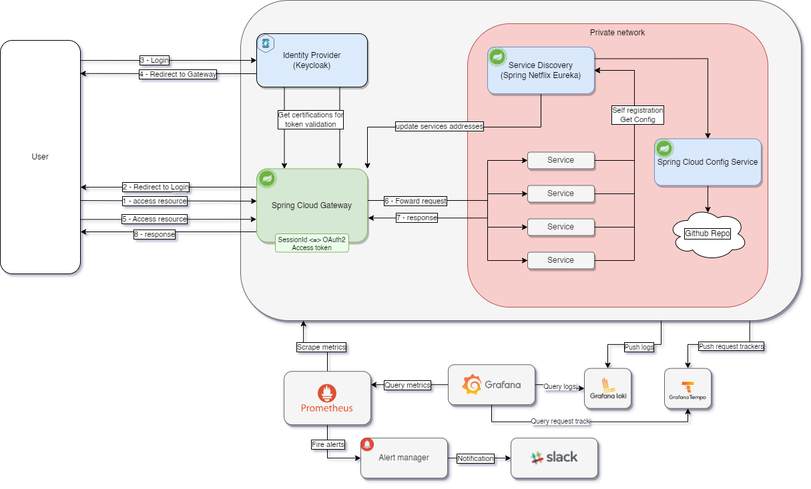

// Settings:
:status:
// URIs:
:uri-build-status-data-service: https://github.com/volalm15/app/actions/workflows/data-service.yml
:img-build-status-data-service: https://github.com/volalm15/var/actions/workflows/data-service.yml/badge.svg?branch=main
:img-build-status-config-service: https://github.com/volalm15/var/actions/workflows/config-service.yml/badge.svg?branch=main
:uri-build-status-config-service: https://github.com/volalm15/app/actions/workflows/config-service.yml
:img-build-status-discovery-service: https://github.com/volalm15/var/actions/workflows/discovery-service.yml/badge.svg?branch=main
:uri-build-status-discovery-service: https://github.com/volalm15/app/actions/workflows/discovery-service.yml
:img-build-status-edge-service: https://github.com/volalm15/var/actions/workflows/edge-service.yml/badge.svg?branch=main
:uri-build-status-edge-service: https://github.com/volalm15/app/actions/workflows/edge-service.yml

= Spring Cloud Playground

== Service Build Status

ifdef::status[]
image:{img-build-status-data-service}[Build Status Badge,link={img-build-status-data-service}]
image:{img-build-status-config-service}[Build Status Badge,link={img-build-status-config-service}]
image:{img-build-status-discovery-service}[Build Status Badge,link={img-build-status-discovery-service}]
image:{img-build-status-edge-service}[Build Status Badge,link={img-build-status-edge-service}]
endif::[]

=== Hello world?

This is a playground for Spring Cloud.
It is a web application that allows you to experiment with Spring Cloud features.

=== How to run?

- Java 17
- Docker Engine
- Docker Compose

After cloning the repository, you can run the application using the following command:
`docker compose --env-file prod.env up`

Don't forget to set the environment variables in the `prod.env` file.
You can find the list of required variables in the `prod.env.example` example file.

Port List:

- 9000: Edge Service
- 9001: Config Service
- 9002: Discovery Service
- 8000: Data Service

== Service Overview

