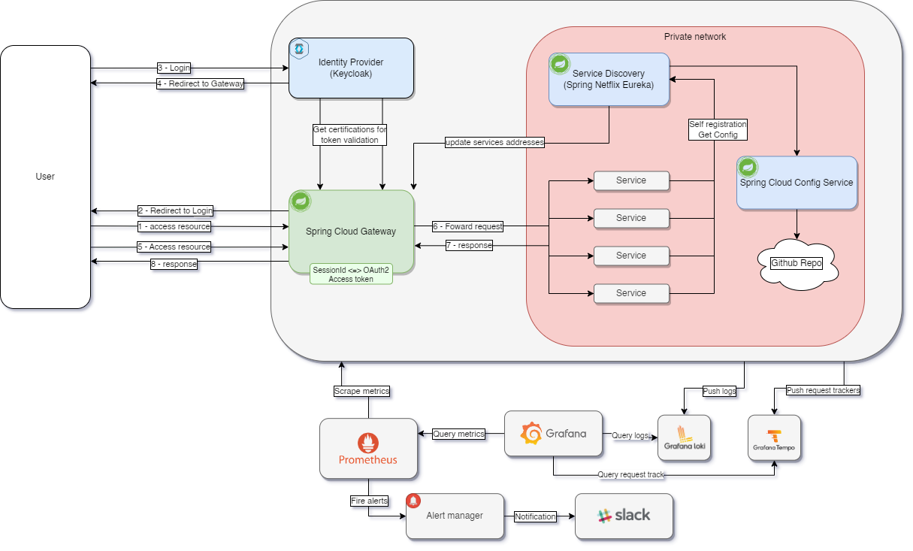

# ⚡Spring Cloud Playground 

### Service Build Status 

#### Hello world?
This is a playground for Spring Cloud. It is a complex web application that allows you to experiment with Spring Cloud features.

#### How to run?
- Java 17
- Docker Engine
- Docker Compose

After cloning the repository, you can run the application using the following command:
`docker compose --env-file prod.env up`

Don't forget to set the environment variables in the `prod.env` file. You can find the list of required variables in the `prod.env.example` example file.
### Service Overview
